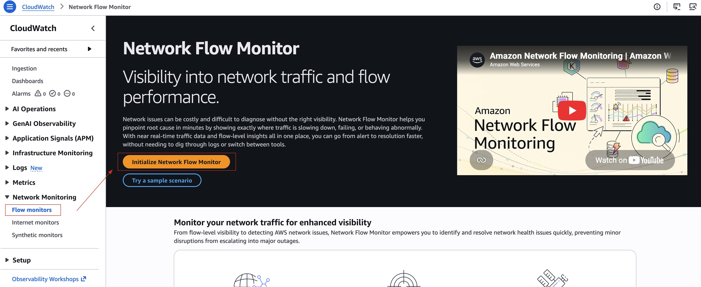
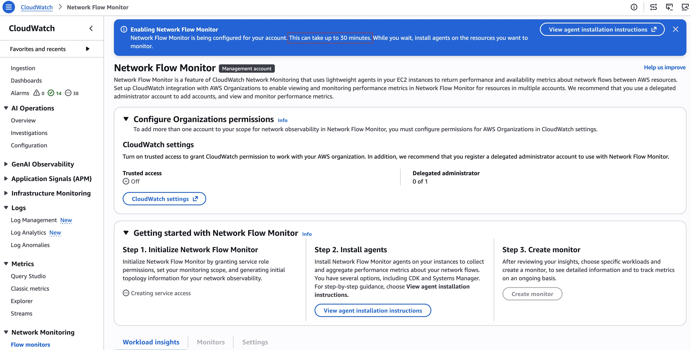
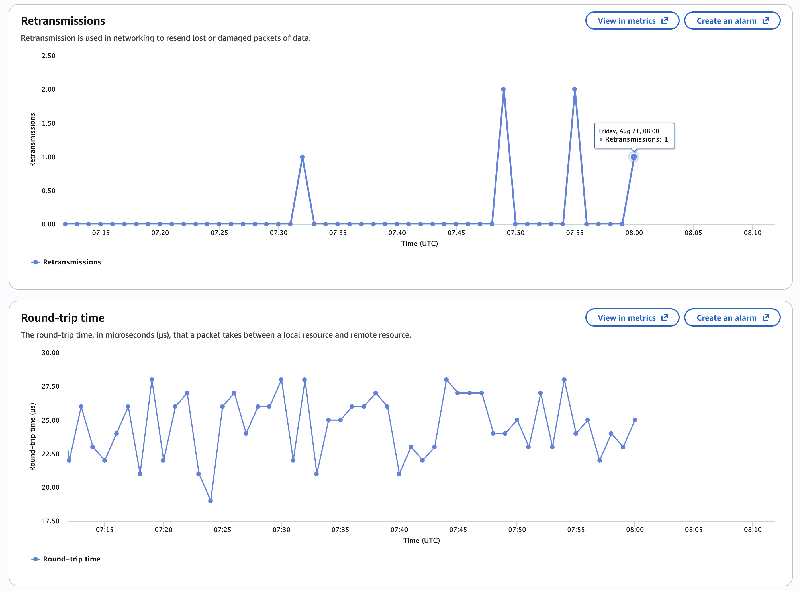
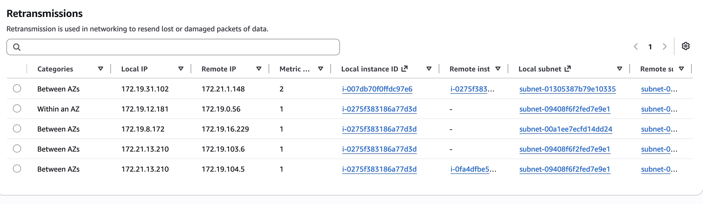
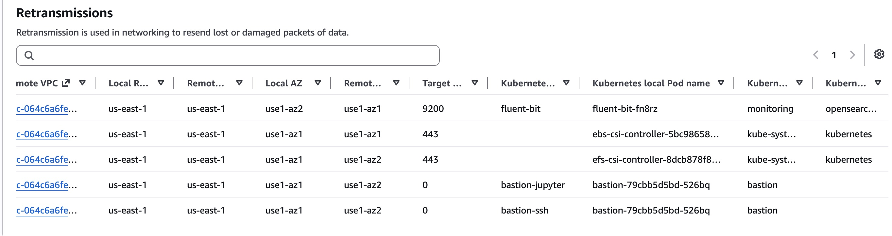

# EKS 网络可观测性 — 方案设计

## 问题描述

EKS 生产集群 (`DBA-EKS-Prod`, us-east-1) 的应用 Pod（节点组 `heavy-load-133`，m7i.8xlarge 机型）与 OceanBase 数据库（通过跨账号 VPC PrivateLink 端点访问）之间出现间歇性 TCP 连接延迟抖动。

当前排查手段局限于：
- 客户侧慢日志（仅应用层）
- AWS Dexter/Pimms 基础设施调查（需提交工单，事后分析）

目前缺少持续的、Pod 级别的网络性能基线，无法区分 AWS 基础设施问题与应用/第三方（OceanBase 提供商）问题。

## 建议方案

部署 **Amazon CloudWatch Network Flow Monitor (NFM)** 并启用 **EKS 容器网络可观测性** 功能，实现持续的 Pod 级 TCP 性能监控。

## 架构

```
┌─────────────────────────────────────────────────────────────────┐
│  EKS 集群 (DBA-EKS-Prod, us-east-1)                            │
│                                                                 │
│  ┌─────────────┐  ┌─────────────┐  ┌─────────────┐            │
│  │  应用 Pod   │  │  应用 Pod   │  │  应用 Pod   │            │
│  │  (OB 客户端)│  │  (OB 客户端)│  │  (OB 客户端)│            │
│  └──────┬──────┘  └──────┬──────┘  └──────┬──────┘            │
│         │                 │                 │                    │
│  ┌──────┴─────────────────┴─────────────────┴──────┐           │
│  │           工作节点 (m7i.8xlarge)                  │           │
│  │  ┌──────────────────────────────────────────┐   │           │
│  │  │  NFM Agent (DaemonSet, 基于 eBPF)        │   │           │
│  │  │  - 按 Pod 粒度采集 TCP 流量指标           │   │           │
│  │  │  - 每 30 秒上报至 NFM 后端               │   │           │
│  │  │  - 暴露 OpenMetrics 接口供 Prometheus 抓取│   │           │
│  │  └──────────────────────────────────────────┘   │           │
│  └─────────────────────────────────────────────────┘           │
│                                                                 │
└──────────────────────────┬──────────────────────────────────────┘
                           │ TCP 流量通过 VPC Endpoint
                           ▼
              ┌────────────────────────┐
              │  OceanBase（跨账号      │
              │  PrivateLink 服务）     │
              └────────────────────────┘
```

## 获得的能力

### 流级别指标（按源 Pod 到目标的粒度）

| 指标 | 说明 | 用途 |
|------|------|------|
| TCP 重传次数 (RT) | 因丢包或损坏而重新发送的数据包数 | 检测 Pod 与 VPCE 之间的丢包情况 |
| TCP 重传超时次数 (RTO) | 发送方等待 ACK 超时的次数 | 检测持续性连接问题（比 RT 更严重） |
| 传输数据量 (bytes) | 每条流的传输字节数 | 建立正常流量基线；检测异常 |
| 往返时间 (RTT) | TCP 握手延迟 | 测量网络路径延迟 |

### 系统指标（按 Pod/节点粒度，可被 Prometheus 抓取）

| 指标 | 说明 | 用途 |
|------|------|------|
| `ingress_flow` / `egress_flow` | TCP 连接数 | 跟踪连接变化 |
| `ingress_bytes` / `egress_bytes` | 字节计数器 | 带宽利用率 |
| `bw_in_allowance_exceeded` | 入站带宽限制被触发 | **直接证明主机级别争抢** |
| `bw_out_allowance_exceeded` | 出站带宽限制被触发 | **直接证明主机级别争抢** |
| `pps_allowance_exceeded` | 每秒包数限制被触发 | 检测网络节流 |
| `conntrack_allowance_exceeded` | 连接跟踪表限制被触发 | 连接表耗尽检测 |

### 网络健康指示器 (NHI)

- 每个 Monitor 的二值指标：是否存在 **AWS 基础设施导致** 的网络问题？
- 消除猜测：NHI = Degraded 说明问题在 AWS 侧；NHI = Healthy 则应排查应用/提供商侧

### 控制台可视化（EKS 控制台 > 可观测性 > 网络）

- **服务拓扑图 (Service Map)**：Pod 间通信的可视化图形，叠加 RT/RTO/DT 指标
- **流量表 (Flow Table)**：按重传次数排名的 Top Talker，支持筛选：
  - 集群视图（同 AZ 内、跨 AZ）
  - AWS 服务视图（Pod 到 S3/DynamoDB）
  - 外部视图（Pod 到 VPCE/互联网）

## 实施步骤

### 步骤 1：创建 NFM Scope（每账号一次）

```bash
ACCOUNT_ID="231038569223"
REGION="us-east-1"

aws networkflowmonitor create-scope \
  --targets "[{\"targetIdentifier\":{\"targetId\":{\"accountId\":\"${ACCOUNT_ID}\"},\"targetType\":\"ACCOUNT\"},\"region\":\"${REGION}\"}]" \
  --region $REGION
```

### 步骤 2：安装 NFM Agent EKS 插件

```bash
aws eks create-addon \
  --cluster-name DBA-EKS-Prod \
  --addon-name aws-network-flow-monitoring-agent \
  --region us-east-1
```

IAM 权限：通过 Pod Identity 或 IRSA 关联 `CloudWatchNetworkFlowMonitorAgentPublishPolicy`。

### 步骤 3：创建 NFM Monitor（以 EKS 集群为本地资源）

```bash
CLUSTER_ARN="arn:aws:eks:us-east-1:231038569223:cluster/DBA-EKS-Prod"
SCOPE_ARN="<步骤 1 返回的 ARN>"

aws networkflowmonitor create-monitor \
  --monitor-name "dba-eks-prod-monitor" \
  --local-resources "type=AWS::EKS::Cluster,identifier=${CLUSTER_ARN}" \
  --remote-resources "type=AWS::Region,identifier=us-east-1" \
  --scope-arn "$SCOPE_ARN" \
  --region us-east-1
```

### 步骤 4（可选）：启用 Prometheus 抓取

覆盖插件配置以暴露 OpenMetrics 端点：

```yaml
OPEN_METRICS: "on"
OPEN_METRICS_ADDRESS: "0.0.0.0"
OPEN_METRICS_PORT: "9090"
```

然后配置 Prometheus 在 9090 端口抓取 NFM Agent Pod。

## 关键设计决策

| 决策 | 理由 |
|------|------|
| 本地资源 = EKS 集群（非子网） | 启用 Pod 级粒度，含 namespace/node 元数据 |
| 远端资源 = Region | 捕获所有流量，包括到 VPCE 端点的流量 |
| 通过 EKS 插件部署 NFM Agent（非独立安装） | DaemonSet 方式部署，自动关联 Pod 元数据 |
| 启用 OpenMetrics | 与现有 Prometheus/Grafana 监控栈集成 |

## 如何解决当前问题

| 当前状态 | 部署 NFM 后 |
|----------|-------------|
| 客户从应用日志报告"延迟抖动" | 持续的 RT/RTO 指标，按 Pod、按目标分组 |
| 排查需提交工单等待基础设施调查 | 自助查看 NHI 判断是否 AWS 责任 |
| 无法区分 AWS 基础设施问题 vs OceanBase 提供商问题 | 流量指标精确显示重传发生在哪个环节 |
| "邻居干扰"指控缺乏证据 | `bw_*_allowance_exceeded` 指标可证实/证伪主机争抢 |
| 仅能事后分析 | 可对 RT/RTO 峰值设置实时告警 |

## 前置条件

- EKS 集群版本：任何受支持版本
- NFM Agent 插件最低版本：v1.1.0
- Pod 不可使用 `hostNetwork: true`（Pod 需运行在独立网络命名空间）
- IAM：NFM Agent Pod 需关联 `CloudWatchNetworkFlowMonitorAgentPublishPolicy`

## 限制

- Top Contributors API 按 1 小时窗口聚合（非逐秒实时）
- Agent 每 30 秒采集数据量最大的前 500 条流
- RTT 数据可能稀疏（非每条流都计算）
- NFM 支持区域：需确认可用性（us-east-1 已支持）
- 规模上限：单账号约 5,000 个工作节点

## 费用

- Network Flow Monitor 按发布的指标数量计费
- 无额外 EC2/网络费用（基于 eBPF，CPU/内存开销可忽略）
- 参见：https://aws.amazon.com/cloudwatch/pricing/（Network Flow Monitor 部分）

## 后续步骤

1. 在 `DBA-EKS-Prod` 集群（账号 231038569223）部署 NFM
2. 建立 1 周基线：heavy-load-133 -> OceanBase VPCE 流量的 RT/RTO 水平
3. 设置 CloudWatch 告警：RT 峰值超过阈值（阈值待基线确定）
4. 下次发生"抖动"时检查：
   - NHI 值（AWS 归因）
   - `bw_*_allowance_exceeded`（主机争抢证据）
   - 特定 Pod -> VPCE 流的 RT/RTO（定位受影响 Pod）
5. 用证据驱动解决：如带宽超限则转用专用实例；如 NHI 正常且无超限则排查 OceanBase 提供商；如有具体数据则提交 AWS 工单


ref:










