# Kiro

## 登录

可以選擇:

    Social login（社交账号登录）：
        Google
        Github
    Builder ID
    Organization（组织）

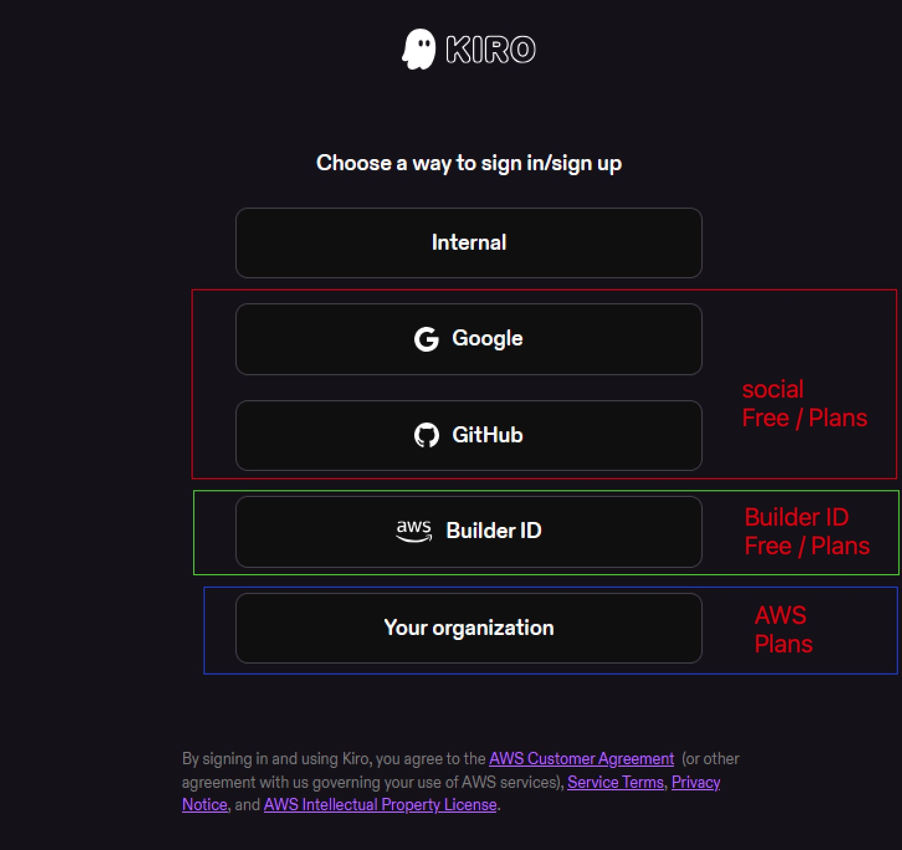

如果想试用 Free plan（免费计划），客户可以使用社交账号登录，或者注册一个同样免费的 Builder ID。
    https://aws.amazon.com/builder/

## Models（模型）

使用 Builder ID Free plan 时，可以访问部分模型，可用的模型可能因地区/IP 不同而有所差异。

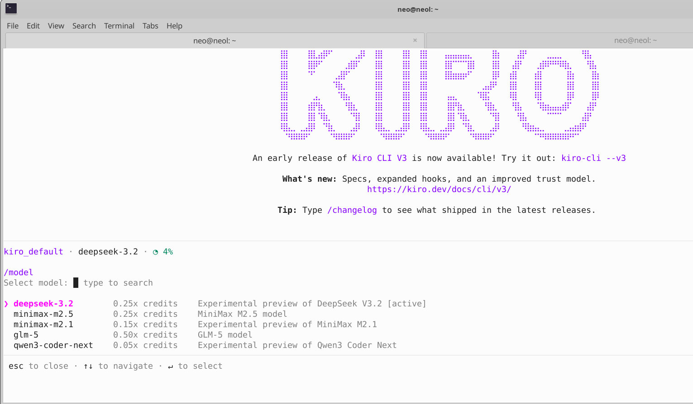

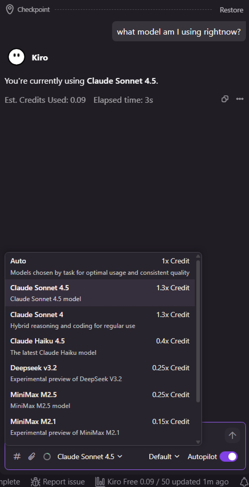

## 使用付费计划

通过 AWS Account 付费/订阅可以获得更多 credits 和更多模型。我们可以在 AWS 上订阅 Kiro。计划如下：

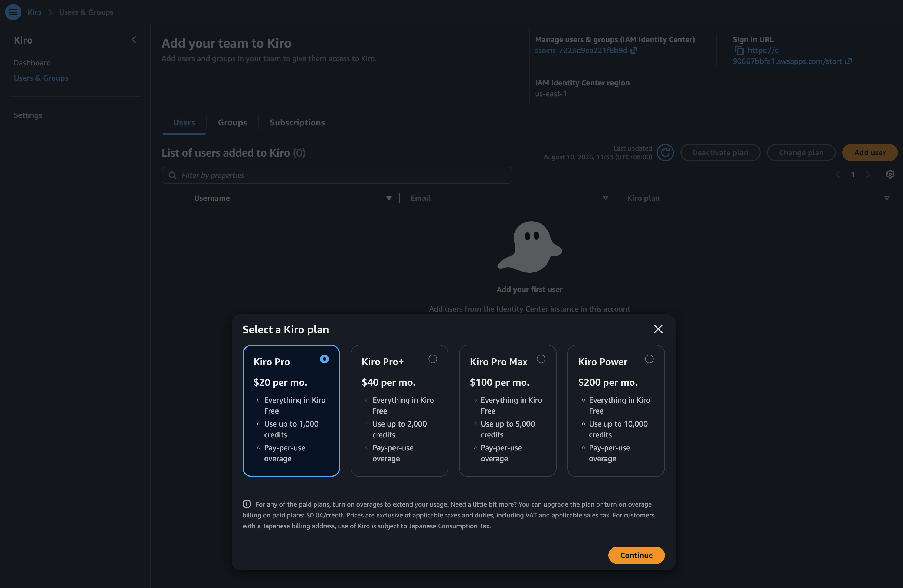

要订阅的话，我们需要先在 AWS 上启用 Kiro：

### 启用 Kiro

访问 Kiro：https://us-east-1.console.aws.amazon.com/amazonq/developer/home?region=us-east-1

点击 "Sign up for Kiro"，然后选择 "IAM Identity Center"。

按照步骤设置 IAM Identity Center instance（如果还没有的话）。
    选择 'Enable'

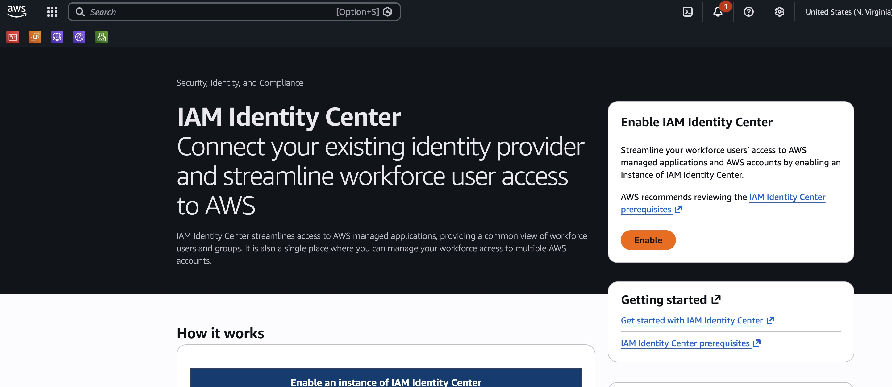

简单设置的话，选择 Single region 即可。

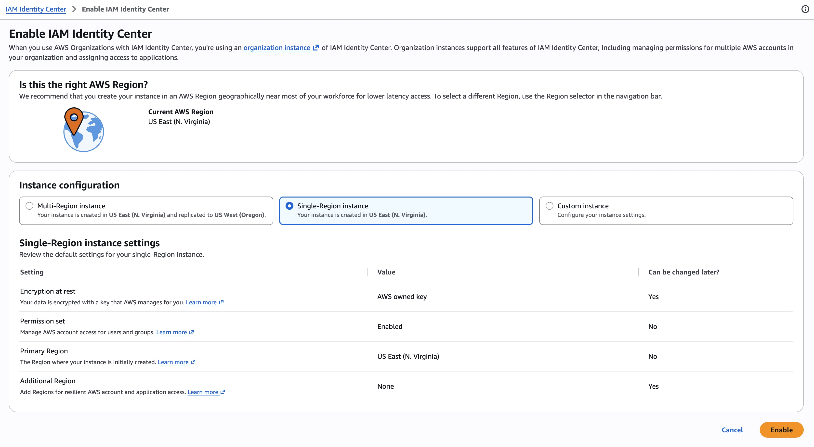

如果需要高可用性，选择 Multi-Region。

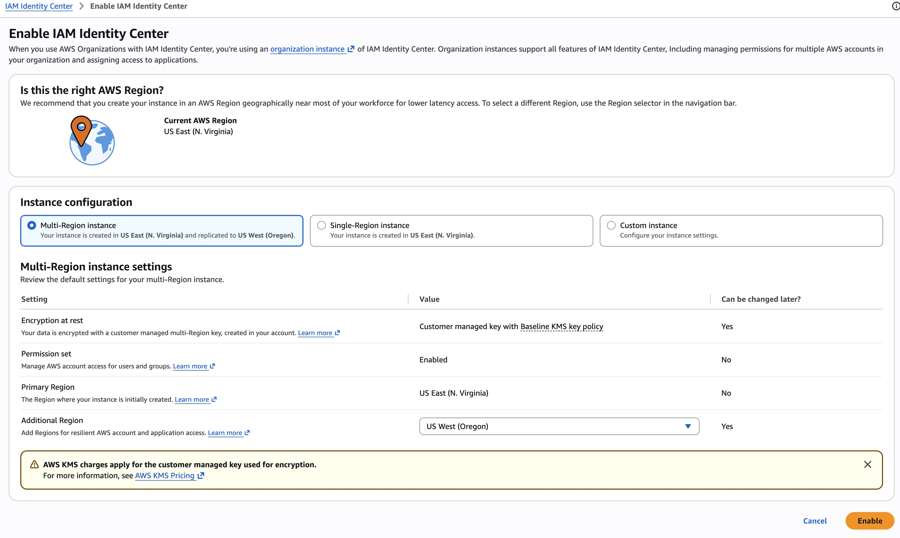

完成 IAM Identity Center 设置后，启用 Kiro。

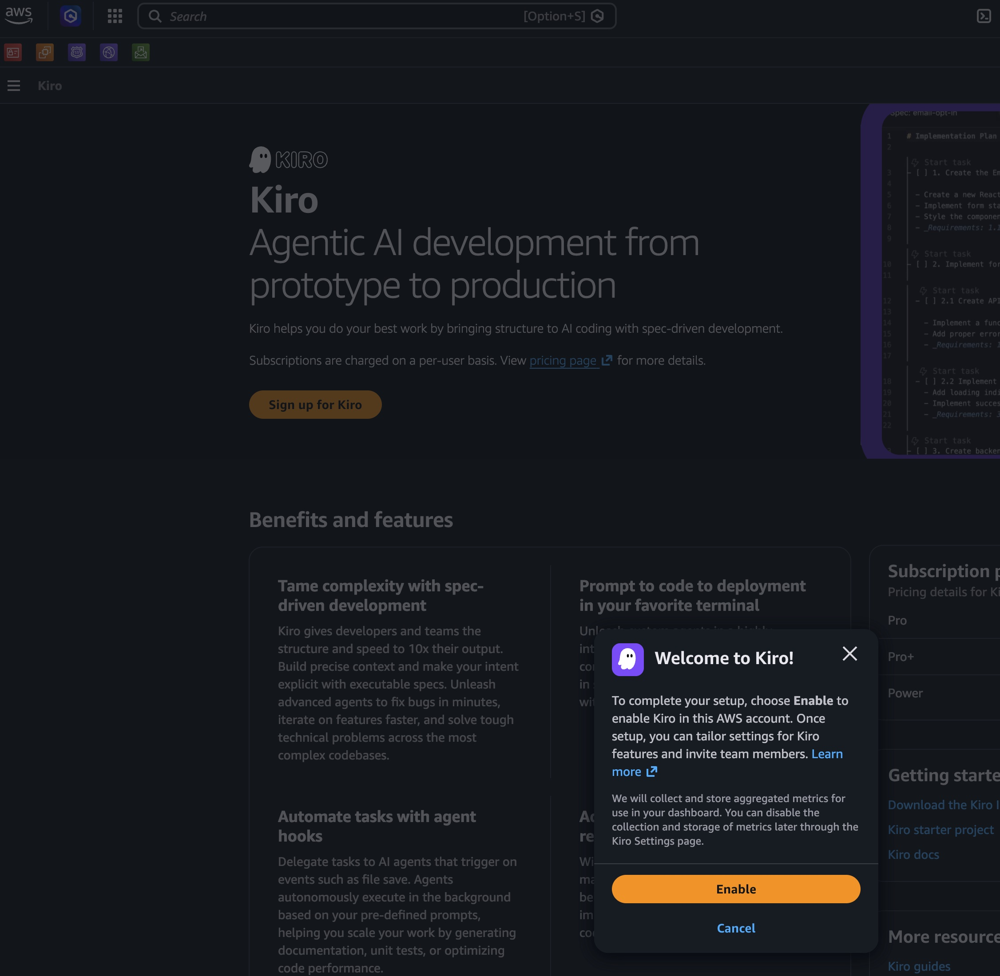

在新设置的 IAM Identity Center 中添加用户，

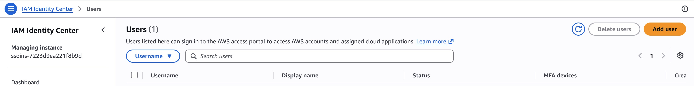

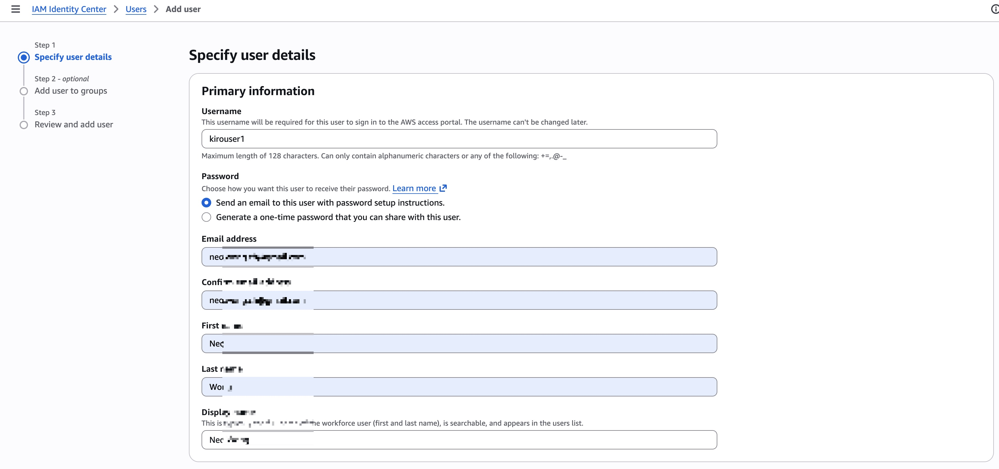

成功添加用户后，在 Kiro 中添加用户并选择计划

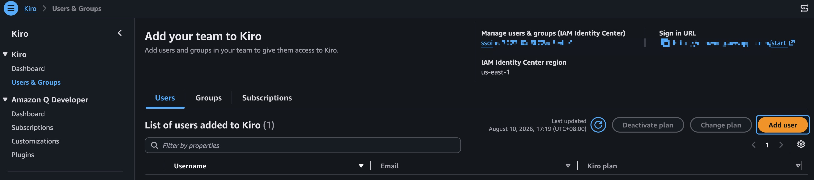

选择在 IAM Identity Center 中新创建的用户

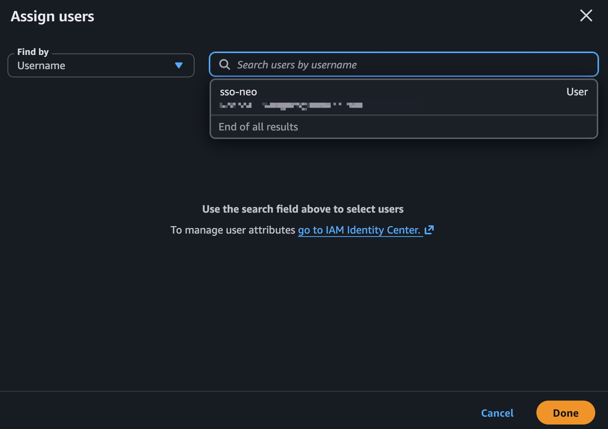

记下 Sign URL

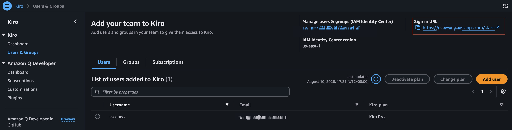

现在从免费计划切换到付费计划：

退出之前的登录，通过 "Your organization" 登录，如果出现选项请确保选择 "Sign in Via IAM Identity Center"。

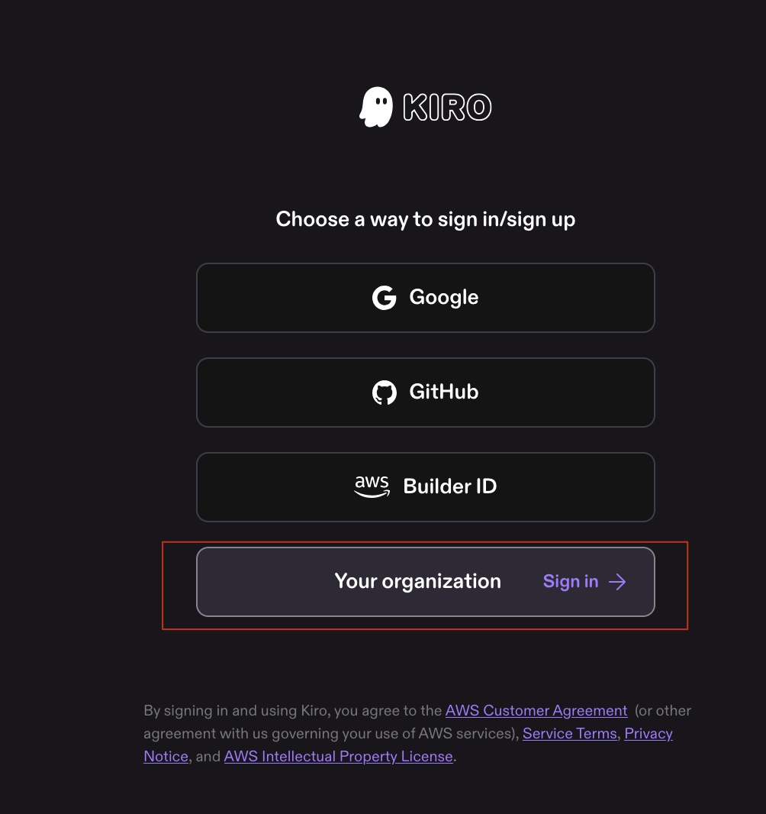

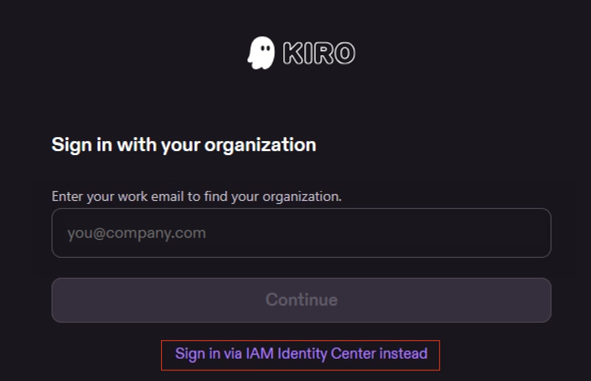

提供 sign in URL 和 region。

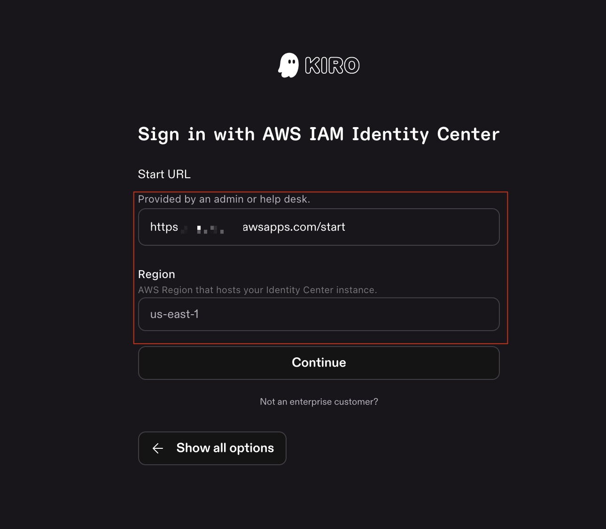

使用在 IAM Identity Center 中设置的用户名/密码完成登录

现在计划拥有更多 Credits 了。

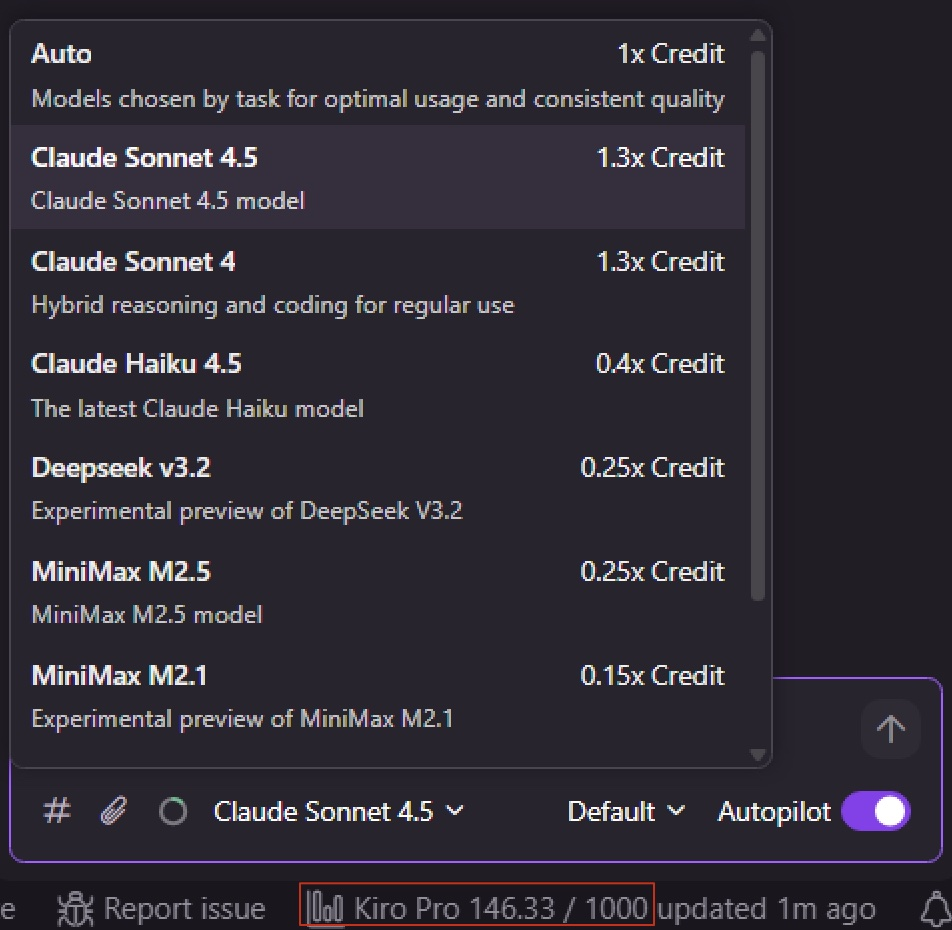
